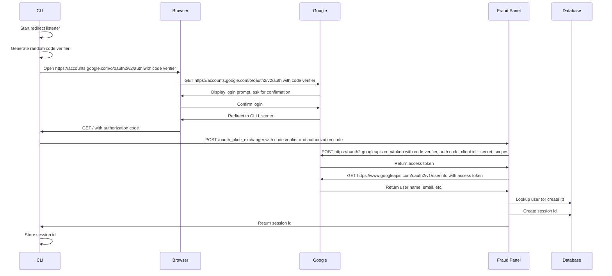

# Authentication

## Command line login using OAuth2 PKCE

[![](https://mermaid.ink/img/eyJjb2RlIjoic2VxdWVuY2VEaWFncmFtXG5cdENMSS0-PkNMSTogU3RhcnQgcmVkaXJlY3QgbGlzdGVuZXJcblx0Q0xJLT4-Q0xJOiBHZW5lcmF0ZSByYW5kb20gY29kZSB2ZXJpZmllclxuXHRDTEktPj5Ccm93c2VyOiBPcGVuIGh0dHBzOi8vYWNjb3VudHMuZ29vZ2xlLmNvbS9vL29hdXRoMi92Mi9hdXRoIHdpdGggY29kZSB2ZXJpZmllclxuXHRCcm93c2VyLT4-R29vZ2xlOiBHRVQgaHR0cHM6Ly9hY2NvdW50cy5nb29nbGUuY29tL28vb2F1dGgyL3YyL2F1dGggd2l0aCBjb2RlIHZlcmlmaWVyXG5cdEdvb2dsZS0-PkJyb3dzZXI6IERpc3BsYXkgbG9naW4gcHJvbXB0LCBhc2sgZm9yIGNvbmZpcm1hdGlvblxuXHRCcm93c2VyLT4-R29vZ2xlOiBDb25maXJtIGxvZ2luXG5cdEdvb2dsZS0-PkJyb3dzZXI6IFJlZGlyZWN0IHRvIENMSSBMaXN0ZW5lclxuXHRCcm93c2VyLT4-Q0xJOiBHRVQgLyB3aXRoIGF1dGhvcml6YXRpb24gY29kZVxuXHRDTEktPj5GcmF1ZCBQYW5lbDogUE9TVCAvb2F1dGhfcGtjZV9leGNoYW5nZXIgd2l0aCBjb2RlIHZlcmlmaWVyIGFuZCBhdXRob3JpemF0aW9uIGNvZGVcblx0RnJhdWQgUGFuZWwtPj5Hb29nbGU6IFBPU1QgaHR0cHM6Ly9vYXV0aDIuZ29vZ2xlYXBpcy5jb20vdG9rZW4gd2l0aCBjb2RlIHZlcmlmaWVyLCBhdXRoIGNvZGUsIGNsaWVudCBpZCArIHNlY3JldCwgc2NvcGVzXG5cdEdvb2dsZS0-PkZyYXVkIFBhbmVsOiBSZXR1cm4gYWNjZXNzIHRva2VuXG5cdEZyYXVkIFBhbmVsLT4-R29vZ2xlOiBHRVQgaHR0cHM6Ly93d3cuZ29vZ2xlYXBpcy5jb20vb2F1dGgyL3YxL3VzZXJpbmZvIHdpdGggYWNjZXNzIHRva2VuXG5cdEdvb2dsZS0-PkZyYXVkIFBhbmVsOiBSZXR1cm4gdXNlciBuYW1lLCBlbWFpbCwgZXRjLlxuXHRGcmF1ZCBQYW5lbC0-PkRhdGFiYXNlOiBMb29rdXAgdXNlciAob3IgY3JlYXRlIGl0KVxuXHRGcmF1ZCBQYW5lbC0-PkRhdGFiYXNlOiBDcmVhdGUgc2Vzc2lvbiBpZFxuXHRGcmF1ZCBQYW5lbC0-PkNMSTogUmV0dXJuIHNlc3Npb24gaWRcblx0Q0xJLT4-Q0xJOiBTdG9yZSBzZXNzaW9uIGlkIiwibWVybWFpZCI6eyJ0aGVtZSI6ImRlZmF1bHQifSwidXBkYXRlRWRpdG9yIjpmYWxzZX0)](https://mermaid-js.github.io/mermaid-live-editor/#/edit/eyJjb2RlIjoic2VxdWVuY2VEaWFncmFtXG5cdENMSS0-PkNMSTogU3RhcnQgcmVkaXJlY3QgbGlzdGVuZXJcblx0Q0xJLT4-Q0xJOiBHZW5lcmF0ZSByYW5kb20gY29kZSB2ZXJpZmllclxuXHRDTEktPj5Ccm93c2VyOiBPcGVuIGh0dHBzOi8vYWNjb3VudHMuZ29vZ2xlLmNvbS9vL29hdXRoMi92Mi9hdXRoIHdpdGggY29kZSB2ZXJpZmllclxuXHRCcm93c2VyLT4-R29vZ2xlOiBHRVQgaHR0cHM6Ly9hY2NvdW50cy5nb29nbGUuY29tL28vb2F1dGgyL3YyL2F1dGggd2l0aCBjb2RlIHZlcmlmaWVyXG5cdEdvb2dsZS0-PkJyb3dzZXI6IERpc3BsYXkgbG9naW4gcHJvbXB0LCBhc2sgZm9yIGNvbmZpcm1hdGlvblxuXHRCcm93c2VyLT4-R29vZ2xlOiBDb25maXJtIGxvZ2luXG5cdEdvb2dsZS0-PkJyb3dzZXI6IFJlZGlyZWN0IHRvIENMSSBMaXN0ZW5lclxuXHRCcm93c2VyLT4-Q0xJOiBHRVQgLyB3aXRoIGF1dGhvcml6YXRpb24gY29kZVxuXHRDTEktPj5GcmF1ZCBQYW5lbDogUE9TVCAvb2F1dGhfcGtjZV9leGNoYW5nZXIgd2l0aCBjb2RlIHZlcmlmaWVyIGFuZCBhdXRob3JpemF0aW9uIGNvZGVcblx0RnJhdWQgUGFuZWwtPj5Hb29nbGU6IFBPU1QgaHR0cHM6Ly9vYXV0aDIuZ29vZ2xlYXBpcy5jb20vdG9rZW4gd2l0aCBjb2RlIHZlcmlmaWVyLCBhdXRoIGNvZGUsIGNsaWVudCBpZCArIHNlY3JldCwgc2NvcGVzXG5cdEdvb2dsZS0-PkZyYXVkIFBhbmVsOiBSZXR1cm4gYWNjZXNzIHRva2VuXG5cdEZyYXVkIFBhbmVsLT4-R29vZ2xlOiBHRVQgaHR0cHM6Ly93d3cuZ29vZ2xlYXBpcy5jb20vb2F1dGgyL3YxL3VzZXJpbmZvIHdpdGggYWNjZXNzIHRva2VuXG5cdEdvb2dsZS0-PkZyYXVkIFBhbmVsOiBSZXR1cm4gdXNlciBuYW1lLCBlbWFpbCwgZXRjLlxuXHRGcmF1ZCBQYW5lbC0-PkRhdGFiYXNlOiBMb29rdXAgdXNlciAob3IgY3JlYXRlIGl0KVxuXHRGcmF1ZCBQYW5lbC0-PkRhdGFiYXNlOiBDcmVhdGUgc2Vzc2lvbiBpZFxuXHRGcmF1ZCBQYW5lbC0-PkNMSTogUmV0dXJuIHNlc3Npb24gaWRcblx0Q0xJLT4-Q0xJOiBTdG9yZSBzZXNzaW9uIGlkIiwibWVybWFpZCI6eyJ0aGVtZSI6ImRlZmF1bHQifSwidXBkYXRlRWRpdG9yIjpmYWxzZX0)

