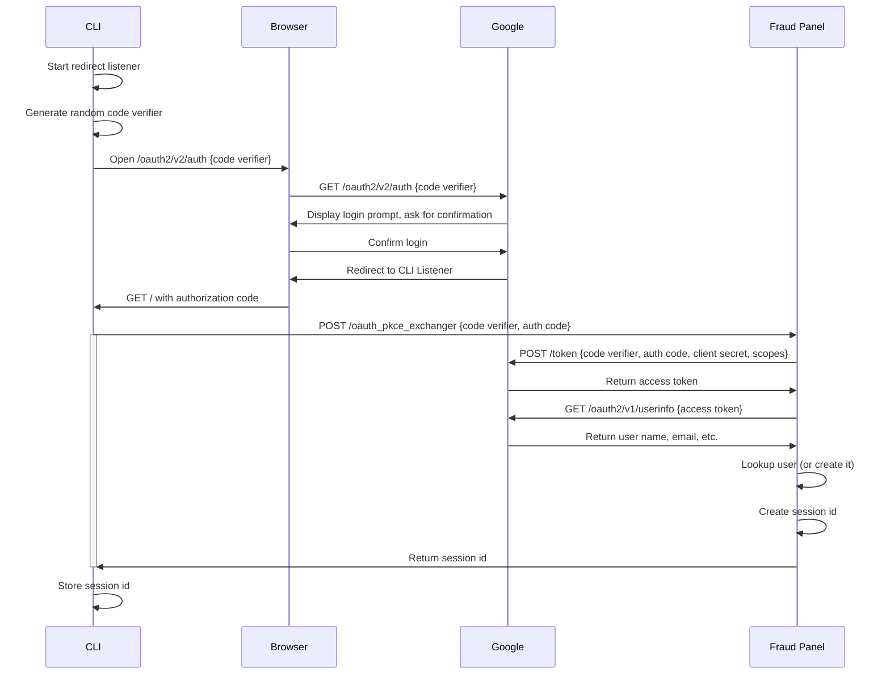

# Authentication

## Command line login using OAuth2 PKCE

[![](https://mermaid.ink/img/eyJjb2RlIjoic2VxdWVuY2VEaWFncmFtXG5cdENMSS0-PkNMSTogU3RhcnQgcmVkaXJlY3QgbGlzdGVuZXJcblx0Q0xJLT4-Q0xJOiBHZW5lcmF0ZSByYW5kb20gY29kZSB2ZXJpZmllclxuXHRDTEktPj5Ccm93c2VyOiBPcGVuIC9vYXV0aDIvdjIvYXV0aCB7Y29kZSB2ZXJpZmllcn1cblx0QnJvd3Nlci0-Pkdvb2dsZTogR0VUIC9vYXV0aDIvdjIvYXV0aCB7Y29kZSB2ZXJpZmllcn1cblx0R29vZ2xlLT4-QnJvd3NlcjogRGlzcGxheSBsb2dpbiBwcm9tcHQsIGFzayBmb3IgY29uZmlybWF0aW9uXG5cdEJyb3dzZXItPj5Hb29nbGU6IENvbmZpcm0gbG9naW5cblx0R29vZ2xlLT4-QnJvd3NlcjogUmVkaXJlY3QgdG8gQ0xJIExpc3RlbmVyXG5cdEJyb3dzZXItPj5DTEk6IEdFVCAvIHdpdGggYXV0aG9yaXphdGlvbiBjb2RlXG5cdENMSS0-PkZyYXVkIFBhbmVsOiBQT1NUIC9vYXV0aF9wa2NlX2V4Y2hhbmdlciB7Y29kZSB2ZXJpZmllciwgYXV0aCBjb2RlfVxuXHRhY3RpdmF0ZSBDTElcblx0RnJhdWQgUGFuZWwtPj5Hb29nbGU6IFBPU1QgL3Rva2VuIHtjb2RlIHZlcmlmaWVyLCBhdXRoIGNvZGUsIGNsaWVudCBzZWNyZXQsIHNjb3Blc31cblx0R29vZ2xlLT4-RnJhdWQgUGFuZWw6IFJldHVybiBhY2Nlc3MgdG9rZW5cblx0RnJhdWQgUGFuZWwtPj5Hb29nbGU6IEdFVCAvb2F1dGgyL3YxL3VzZXJpbmZvIHthY2Nlc3MgdG9rZW59XG5cdEdvb2dsZS0-PkZyYXVkIFBhbmVsOiBSZXR1cm4gdXNlciBuYW1lLCBlbWFpbCwgZXRjLlxuXHRGcmF1ZCBQYW5lbC0-PkZyYXVkIFBhbmVsOiBMb29rdXAgdXNlciAob3IgY3JlYXRlIGl0KVxuXHRGcmF1ZCBQYW5lbC0-PkZyYXVkIFBhbmVsOiBDcmVhdGUgc2Vzc2lvbiBpZFxuXHRGcmF1ZCBQYW5lbC0-PkNMSTogUmV0dXJuIHNlc3Npb24gaWRcblx0ZGVhY3RpdmF0ZSBDTElcblx0Q0xJLT4-Q0xJOiBTdG9yZSBzZXNzaW9uIGlkIiwibWVybWFpZCI6eyJ0aGVtZSI6ImRlZmF1bHQifSwidXBkYXRlRWRpdG9yIjpmYWxzZX0)](https://mermaid-js.github.io/mermaid-live-editor/#/edit/eyJjb2RlIjoic2VxdWVuY2VEaWFncmFtXG5cdENMSS0-PkNMSTogU3RhcnQgcmVkaXJlY3QgbGlzdGVuZXJcblx0Q0xJLT4-Q0xJOiBHZW5lcmF0ZSByYW5kb20gY29kZSB2ZXJpZmllclxuXHRDTEktPj5Ccm93c2VyOiBPcGVuIC9vYXV0aDIvdjIvYXV0aCB7Y29kZSB2ZXJpZmllcn1cblx0QnJvd3Nlci0-Pkdvb2dsZTogR0VUIC9vYXV0aDIvdjIvYXV0aCB7Y29kZSB2ZXJpZmllcn1cblx0R29vZ2xlLT4-QnJvd3NlcjogRGlzcGxheSBsb2dpbiBwcm9tcHQsIGFzayBmb3IgY29uZmlybWF0aW9uXG5cdEJyb3dzZXItPj5Hb29nbGU6IENvbmZpcm0gbG9naW5cblx0R29vZ2xlLT4-QnJvd3NlcjogUmVkaXJlY3QgdG8gQ0xJIExpc3RlbmVyXG5cdEJyb3dzZXItPj5DTEk6IEdFVCAvIHdpdGggYXV0aG9yaXphdGlvbiBjb2RlXG5cdENMSS0-PkZyYXVkIFBhbmVsOiBQT1NUIC9vYXV0aF9wa2NlX2V4Y2hhbmdlciB7Y29kZSB2ZXJpZmllciwgYXV0aCBjb2RlfVxuXHRhY3RpdmF0ZSBDTElcblx0RnJhdWQgUGFuZWwtPj5Hb29nbGU6IFBPU1QgL3Rva2VuIHtjb2RlIHZlcmlmaWVyLCBhdXRoIGNvZGUsIGNsaWVudCBzZWNyZXQsIHNjb3Blc31cblx0R29vZ2xlLT4-RnJhdWQgUGFuZWw6IFJldHVybiBhY2Nlc3MgdG9rZW5cblx0RnJhdWQgUGFuZWwtPj5Hb29nbGU6IEdFVCAvb2F1dGgyL3YxL3VzZXJpbmZvIHthY2Nlc3MgdG9rZW59XG5cdEdvb2dsZS0-PkZyYXVkIFBhbmVsOiBSZXR1cm4gdXNlciBuYW1lLCBlbWFpbCwgZXRjLlxuXHRGcmF1ZCBQYW5lbC0-PkZyYXVkIFBhbmVsOiBMb29rdXAgdXNlciAob3IgY3JlYXRlIGl0KVxuXHRGcmF1ZCBQYW5lbC0-PkZyYXVkIFBhbmVsOiBDcmVhdGUgc2Vzc2lvbiBpZFxuXHRGcmF1ZCBQYW5lbC0-PkNMSTogUmV0dXJuIHNlc3Npb24gaWRcblx0ZGVhY3RpdmF0ZSBDTElcblx0Q0xJLT4-Q0xJOiBTdG9yZSBzZXNzaW9uIGlkIiwibWVybWFpZCI6eyJ0aGVtZSI6ImRlZmF1bHQifSwidXBkYXRlRWRpdG9yIjpmYWxzZX0)

